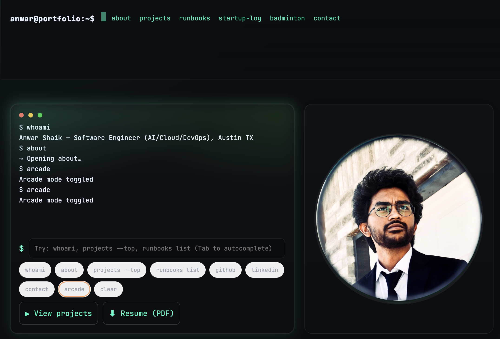

# Anwar Shaik — Terminal Black & Neon Portfolio


A hacker‑minimal personal site for my work in **AI, Cloud, and DevOps**—with a playful terminal on the homepage.  
From **India → USA**; currently in **Austin, Texas**. Outside of code, I’m a **gamer** and **badminton** nerd.

**Live site:** `https://anwarshaik1999.github.io` (or `https://anwarshaik1999.github.io/<repo-name>` if this is a project page)  
**Resume (PDF):** [`Anwar_Resume_Software_Engineer.pdf`](.Assets/Anwar_Resume_Software_Engineer.pdf)  
**GitHub:** [@anwarshaik1999](https://github.com/anwarshaik1999) · **LinkedIn:** [/in/anwar-shaik1](https://www.linkedin.com/in/anwar-shaik1/)

---

## ✨ Highlights

- **AI Projects**
  - **License Plate Recognition (ANPR):** detect, crop, OCR the plate; infer Indian state. *(OpenCV + CNN + Tesseract)*
  - **CAPTCHA OCR (IIT workshop, 2019):** cleaned/segmented characters and recognized text. *(OpenCV + MNIST/EMNIST CNNs)*
- **Cloud/DevOps Runbooks:** copy‑paste checklists for ECS/Fargate migrations, log hygiene, pytest‑xdist, and DNS resilience.
- **Terminal UX:** type commands (or click chips) to jump around the site; includes autocomplete, history, and a fun **Arcade Mode**.

> 🔎 Want a quick skim? Open the live site and type `help` in the prompt.

---

## 🖥 Terminal Commands (on the homepage)

```
help
whoami
about
projects
projects --top
runbooks list
github
linkedin
contact
arcade
clear
```

### Keyboard shortcuts
- **Tab** → autocomplete the current command
- **↑ / ↓** → browse command history
- **Konami code** → toggles **Arcade Mode** (retro CRT vibe)

---

## 📁 Repo Layout (simple static site)

```
.
├── index.html                 # Single-page site (Terminal Black & Neon)
├── Anwar_Resume_Software_Engineer.pdf
└── assets/
    └── portrait.jpg           # Your photo (replace with your own)
```

> No build step needed. It’s plain HTML/CSS/JS for maximum GitHub Pages compatibility.

---

## 🚀 Run locally

```bash
git clone https://github.com/<you>/<this-repo>.git
cd <this-repo>
# Option A: open index.html directly in your browser
# Option B (nicer URLs): serve the folder
python -m http.server 3000
# → http://localhost:3000
```

---

## 🌐 Deploy to GitHub Pages

**If this is your root site** (`<username>.github.io`):
1. Push `index.html` (and the assets) to `main`.
2. Repo → **Settings** → **Pages** → Source: `main` → root.
3. You’re live at `https://<username>.github.io`.

**If this is a project site** (anything else):
1. Push to `main`.
2. Repo → **Settings** → **Pages** → Source: `main` → root or `/docs`.
3. Your URL will be `https://<username>.github.io/<repo-name>`.

> Using a **custom domain**? Add it under Settings → Pages and commit a `CNAME` file at repo root.

---

## 🛠 Customize

- **Accent colors:** edit CSS variables in `index.html`:
  ```css
  :root {
    --accent: #00ffc6;  /* cyan */
    --accent-2: #00ff5e;/* green */
  }
  ```
- **Content:** update the **Projects**, **Runbooks**, **Startup Log**, **Badminton** sections inside `index.html`.
- **Images:** put your portrait at `assets/portrait.jpg` (or change the `src` in the Avatar card).
- **Terminal commands:** extend the `COMMANDS` array and `handle(cmd)` function in the `<script>` section.

---

## 📸 Preview

> Add a screenshot to `assets/preview.png` and it’ll render here.



---

## 📬 Contact

- Email: **anwarshaik1999@gmail.com**
- GitHub: **[@anwarshaik1999](https://github.com/anwarshaik1999)**
- LinkedIn: **[/in/anwar-shaik1](https://www.linkedin.com/in/anwar-shaik1/)**

---

## 📝 License

This repository is released under the **MIT License**. Feel free to fork and adapt—attribution appreciated.
